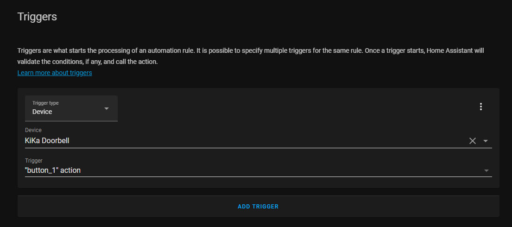

# RTL433 to Home Assistant
![Supports aarch64 Architecture][aarch64-shield] ![Supports amd64 Architecture][amd64-shield] ![Supports armhf Architecture][armhf-shield] ![Supports armv7 Architecture][armv7-shield] ![Supports i386 Architecture][i386-shield]

A Home Assistant addon for a software defined radio tuned to listen for RF transmissions and convert them into [device triggers](https://www.home-assistant.io/integrations/device_trigger.mqtt/).
This device trigger can be used to trigger any automation as soon as a specific message is received.
For example, the add-on allows to integrate the [KAKU ACDB-7000A](https://klikaanklikuit.nl/product/draadloze-drukknop/) to be used in Home Assistant.
Setup is done automatically via [MQTT Discovery](https://www.home-assistant.io/docs/mqtt/discovery/).

This hass.io addon is based on https://hub.docker.com/r/hertzg/rtl_433, which is based on the well-known rtl_433 library (https://github.com/merbanan/rtl_433).
Compared to https://github.com/pbkhrv/rtl_433-hass-addons, this add-on has a few differences:
- Configuration is done via the configuration tab of the addon.
- In default mode, logging is done via the logging tab of the addon.
- The addon is a [pre-built container](https://hub.docker.com/u/gerritjandebruin), allowing much faster installation.
- This addon provides currently only device_triggers, which are well suited for buttons, remote controls, etc.

If anything does not work, or you have trouble using your own RF device, please raise an [issue](https://github.com/gerritjandebruin/ha-rtl/issues/new).

## Usage

1) Install the addon by adding the repository https://github.com/gerritjandebruin/ha-rtl in the add-on store. Or use this button:
[](https://my.home-assistant.io/redirect/supervisor_add_addon_repository/?repository_url=https%3A%2F%2Fgithub.com%2Fgerritjandebruin%2Fha-rtl)

2) Connect to a USB RTL-SDR Dongle supported by [rtl_433](https://github.com/merbanan/rtl_433). For example [this](https://nl.aliexpress.com/item/32476877972.html?spm=a2g0s.9042311.0.0.70924c4d9vmXSr) item.

3) Use addon configuration to configure the protocol, look [here](https://github.com/merbanan/rtl_433). All other configurations can be left unchanged at this time.

4) Start the addon.

5) Trigger your device.

6) In the log of the addon, something like this should present:
```
_ _ _ _ _ _ _ _ _ _ _ _ _ _ _ _ _ _ _ _ 
time      : 2022-02-06 13:33:51
Protocol  : 51
model     : Proove-Security
House Code: xxxxxxxx
Channel   : 3
State     : ON
Unit      : 3
Group     : 1
Modulation: ASK
Freq      : 434.0 MHz
RSSI      : -0.1 dB
SNR       : 10.0 dB
Noise     : -10.1 dB
```

7) Alter your configuration. Now add the id for the device, which should be equal to the House Code of the previous step.

8) Restart the addon.

9) Everything should work as expected. Repeat the procedure to add additional devices.

## Hardware

This has been tested and used with the following hardware:
- KAKU ACDB-7000A (https://www.gamma.nl/assortiment/klikaanklikuit-deurbel-set-acdb-6600ac/p/B413295)  
- cheap rtl receiver ([aliexpress.com](https://aliexpress.com/item/32476877972.html))
- HASS.IO on old laptop, see https://github.com/gerritjandebruin/home-assistant

Total costs: +- €35, including chime and doorbell that work also when HA is down.


## Automations
To use this device in automations, please make use of the visual editor and choose under trigger for "Device".
You should see your device as soon as the add-on starts.
The trigger will be available as soon as you trigger your device after the addon is started.

## Example
Options for HA-RTL:
```yaml
frequencies:
  - 433920000
hop_interval: 10
devices:
  - protocol: 51
    automation_type: device_automation
    trigger_type: action
    trigger_subtype: button_1
    manufacturer: Gamma
    name: KiKa Doorbell
    id: xxxxxxxx
    model: 7000ac
discovery_prefix_mqtt: homeassistant
```

Automation trigger:


## Contact
Open an [issue](https://github.com/gerritjandebruin/ha-rtl/issues/new) if needed.

[aarch64-shield]: https://img.shields.io/badge/aarch64-yes-green.svg
[amd64-shield]: https://img.shields.io/badge/amd64-yes-green.svg
[armhf-shield]: https://img.shields.io/badge/armhf-yes-green.svg
[armv7-shield]: https://img.shields.io/badge/armv7-yes-green.svg
[i386-shield]: https://img.shields.io/badge/i386-yes-green.svg